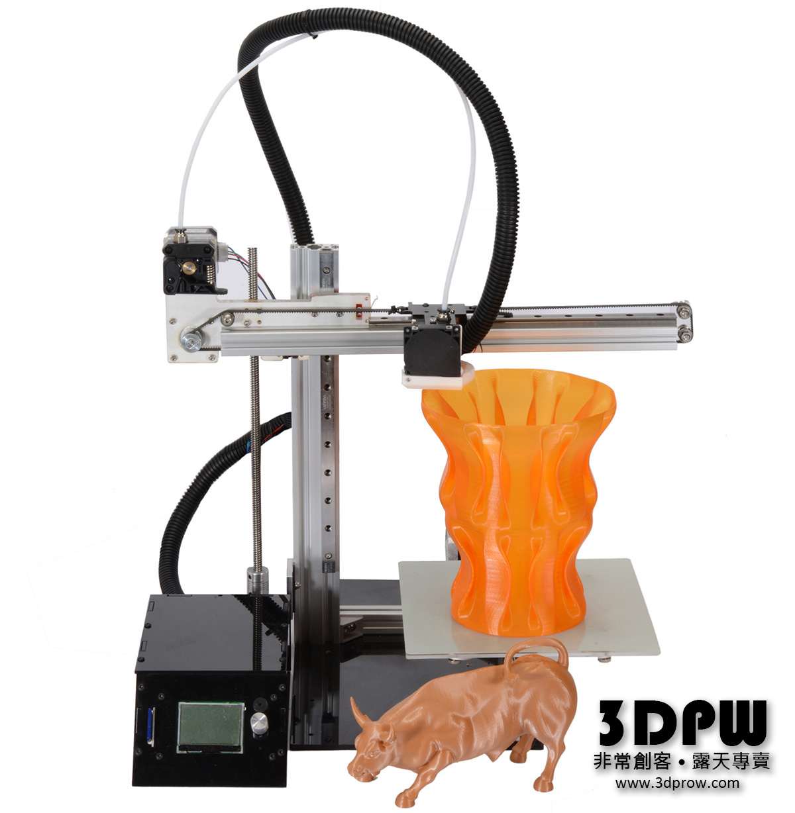

#SV-200
####The Simplest 3D Printer with Liner Guideway (full 200x200x200mm printable area)

###Intro
SV-200 is designed by Taiwan 3DPW Synmao Techlogogy Enterprise Co., Ltd.
It has the simplest cartesian system design with solid structure by aluminum extrusions. SV-200 has full 200x200x200mm printable area.
The most attractive design is SV-200 is using liner guideway for all 3 axis and Z axis is using 8mm T-type leadscrew.
These design really improve print quality a lot.
The hotend is also a new design with Teflon tube staight to the nozzle for no fliament jam.
SV-200 is controlled by seperating control box with 128x64 full graphic LCD. The control box is off from the printer strucutre. This brings benfit when you need flexible space to operate your printer.
This great design is now open source. You are welcome to join this project and improve even more.

###General Spec
200x200x200 printable area  
MGN12H mini Liner guideway for X and Y  
8mm Leadscrew for Z
Remote extruder system

###BOM (Last update 2017/01/03 01:15)
#####Electronics
MKS Gen V1.4  
Endstop (Switch) x2  
Endstop (IR optical) x1  
Fan 3010 DC12V x1 (for control box chassis)  
Fan BFB04512HHA 45mm DC12V (parts cooling)  
Power Switch x1  
Power jack 2.5mm female x1  
Cable 4PIN to 4PIN 100cm x4 (steppers)  
Cable 4PIN to 3PIN 100cm x2 (Endstop switch)  
Cable 3PIN to 3PIN 100cm x1 (Endstop IR optical)  
Bowden Hotend set x1  
USB cable type-B to tyoe-C x1
Power adapter DC12V 5A  
#####Mechnical
2020 aluminum extrusion L370mm x1 (X axis)  
2040 aluminum extrusion L300mm x1 (Y axis)  
2040 aluminum extrusion L350mm x1 (Z axis)  
2028 aluminum extrusion 90 degree corner bracket x2  
2020 aluminum extrusion 90 degree corner bracket x3  
Liner guideway MGN12H 250mm with block x3 sets (All 3 axis)  
Leadscrew with square nut, 4mm lead x1 (Z axis)  
Coupler 5x8 x1  
2GT Belt about 1500mm x1 (X and Y)  
Acrylic (6mm) or aluminum board (3mm) laser cut from a CAD files.  
Acrylic (3mm) laser cut for Control box  
NEMA17 (42mm) L40 Stepper x4 (XYZ and E axis)  
Stepper motor L bracket x1
Teflon tube 2x4 L50 x1  
Extruder (Bowden) x1  
105ZZ bearing x12 (belt idler)
Pully GT2 6mm 20 tooth x 2
Spring 5x18x0.5mm x4
Screws/Washer List
Hex socket  
M3x 6 x4 (X and Z endstop)  
M3x 8 x 58:

	X motor x4
	Y motor x4
	Z motor x4
    X,Z,E axis board x3
	Y motor plate x4
	Y idler plate x4
	liner guideway x9
	liner guideway carriage x16
    Leadscrew nut x4
	Y endstop x2
    Hotend x4

M3x 3 plastic washer x2 (Y endstop)  
M3x25 flat x4  
M5x25 x 6 + wasger x12 (belt idlers)  
M5 nut x12  
T-type nut for 20mm aluminum extrusion x14

	X,Z,E axis board x3
    X liner guideway x3
    Y liner guideway x3
    Z liner guideway x3
    Z motor bracket x2

M3 thumb nut x4  
#####Control box:
M3x16 x22 (button hex socket):

	Chassic x14
    Control board x4
    LCD control panel x4
M3 nut x18:

	Chassis x14
    Control board x4

M3x 3 plastic washer x2:

	Control board x4
    LCD control panel x8
M3 frange nut x4 (LCD cotrol panel)  

(To be complete)

##Where to buy
Parts and DIY sets to be available in 3DPW before Chinese New Year.
